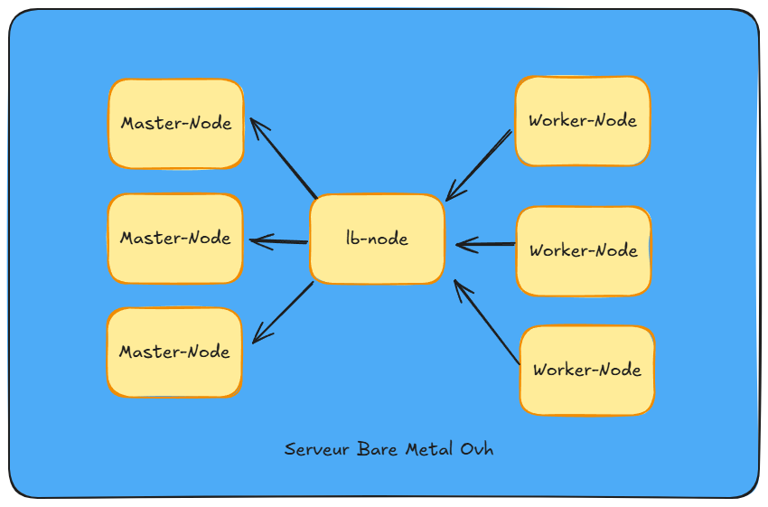

# Homelab-KubeCluster-Ansible

Ce code Ansible permet de provisionner un cluster Kubernetes k8s sur un ensemble de 7 Vms Proxmox crées au préalable avec [Terraform](https://gitlab.com/naim.assoum/homelab-provisionning). Le serveur de virtualisation Proxmox est installé sur un serveur Bare Metal Ovh.


L'architecture comprend :
* 1 `lb-node` pour le `load balancer` haproxy
* 3 `Worker-node` pour les `workers` du cluster Kubernetes
* 3 `Master-node` pour les `master` du cluster Kubernetes

Voici ci-dessous un schéma de l'architecture deployé :



Les roles Ansible utilisés sont les suivants :
* `setup-pre-k8s` qui installe les différentes dépendances pour la création du cluster et configure les hosts au niveau du noyau, réseau
* `packages-lb`qui installe les preréquis pour installer haporxy en tant que load-balancer.
* `haproxy` installe un conteneur docker `haproxy` qui sera utilisé en tant que loadbalancer pour les master nodes et l'api server.
* `k8s` crée le cluster. Le rôle initialise le cluster sur l'instance nommée `master-node-0` puis exécute les commandes join sur les autres machines master et sur les machines workers. Le rôle est idempotent, si le cluster est déjà initialisé ou si le service `kubelet` est up sur le node en question, il véfifiera juste que le cluster est dans un état correct en effectuant un curl sur l'url de healthcheck de l'`api server` .
* `desinstall-k8s`, ce rôle permet de désinstaller k8s sur l'ensembles des vms.

Pour utiliser ce code, il faut disposer d'un inventaire statique ou dynamique pour viser les Vms Proxmox.

On peut exécuter la commande suivante suivie du tag voulue selon le contexte :
```
ansible-playbook -i inventories/host deploy.yml -t <tag>
```

Voici les contextes d'utilisation des tags globaux:
* `k8s` crée le cluster k8s
* `pre-k8s`met en place tout les prérequis pour que l'installation du cluster fonctionne
* `new-install` désinstalle le cluster puis relance une installation


Après la création du cluster, il faut installer un `cni` afin que les différents nodes soient Ready, après cette installation, il faut redémarrer containerd sur l'ensemble du cluster.

La command ansible-console est parfaite pour cela:
```
ansible-console -i inventories/hosts -l '!lb-node'
```